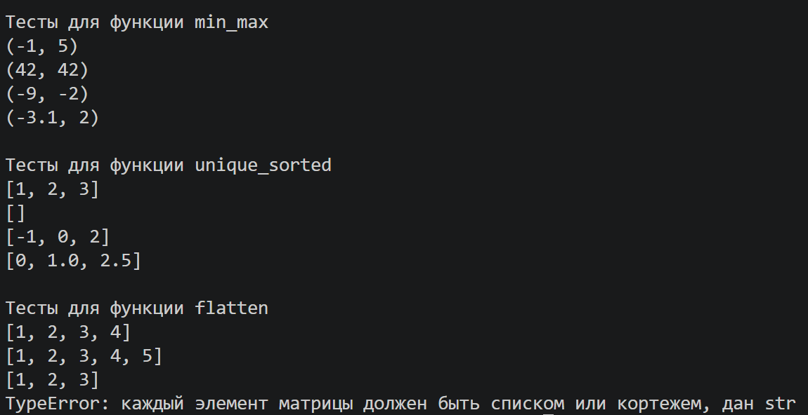
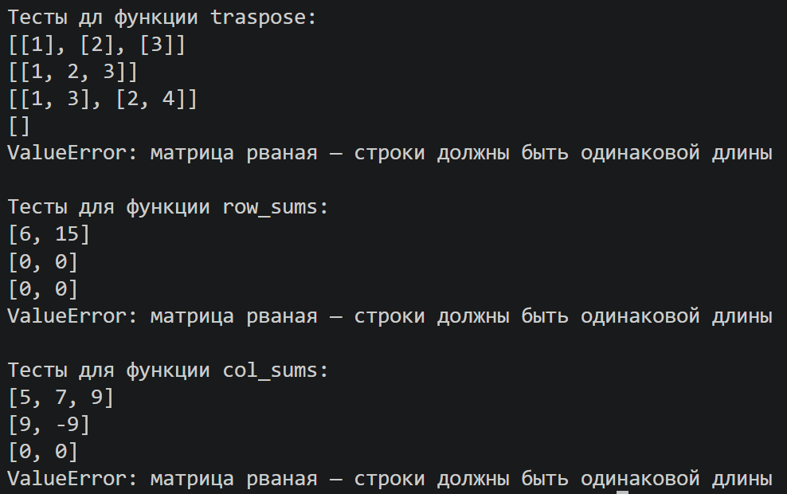

# ЛР2 — Коллекции и матрицы (list/tuple/set/dict)

## Задание A — Списки

Файл: [arrays.py](arrays.py)

### Вернуть кортеж (минимум, максимум).
```py
def min_max(nums: list[float | int]) -> tuple[float | int, float | int]:

    if not nums:
        raise ValueError("список не может быть пуст")

    min_val = max_val = nums[0]
    for num in nums[1:]:
        if num < min_val:
            min_val = num
        if num > max_val:
            max_val = num

    return (min_val, max_val)
```
### Вернуть отсортированный список уникальных значений (по возрастанию).
```py
    def unique_sorted(nums: list[float | int]) -> list[float | int]:

    if not nums:
        return []

    unique = []
    for num in nums:
        if num not in unique:
            unique.append(num)

    for i in range(len(unique)):
        for j in range(i + 1, len(unique)):
            if unique[i] > unique[j]:
                unique[i], unique[j] = unique[j], unique[i]

    return unique
```
### «Расплющить» список списков/кортежей в один список по строкам (row-major).
```py
    def flatten(mat: list[list | tuple]) -> list:

    result = []
    for row in mat:
        if not isinstance(row, (list, tuple)):
            raise TypeError(f"каждый элемент матрицы должен быть списком или кортежем, дан {type(row).__name__}")
        result.extend(row)
    return resul
```
# ----------------------------------------
## Тест-кейсы для задания А


## Задание B — Матрицы

Файл: [matrix.py](matrix.py)

### Поменять строки и столбцы местами. 
```py
def transpose(mat: list[list[float | int]]) -> list[list]:
    
    if not mat:
        return []

    row_length = len(mat[0])
    for row in mat:
        if len(row) != row_length:
            raise ValueError("матрица рваная — строки должны быть одинаковой длины")

    result = []
    for col_idx in range(row_length):
        new_row = []
        for row in mat:
            new_row.append(row[col_idx])
        result.append(new_row)

    return result
```
### Сумма по каждой строке.
```py
def row_sums(mat: list[list[float | int]]) -> list[float]:
    
    if not mat:
        return []

    row_length = len(mat[0])
    for row in mat:
        if len(row) != row_length:
            raise ValueError("матрица рваная — строки должны быть одинаковой длины")

    return [sum(row) for row in mat]
```
### Сумма по каждому столбцу.
```py
def col_sums(mat: list[list[float | int]]) -> list[float]:
    
    if not mat:
        return []

    row_length = len(mat[0])
    for row in mat:
        if len(row) != row_length:
            raise ValueError("матрица рваная — строки должны быть одинаковой длины")

    result = []
    for col_idx in range(row_length):
        col_sum = 0
        for row in mat:
            col_sum += row[col_idx]
        result.append(col_sum)

    return result
```
# ----------------------------------------
## Тест-кейсы для задания Б


## Задание C — Кортежи: запись студента

```py

```


